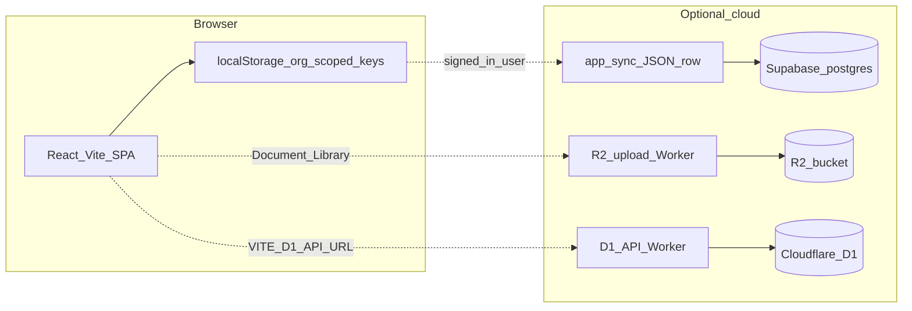

# MySafeOps — current architecture (as implemented)

This document describes the **running application** in the repository root (`src/`), not the historical prototype package in `DOCS/rams-pro.jsx`.

## High level

- **Primary persistence:** `localStorage`, with keys scoped by organisation id (`mysafeops_orgId`, default `default`).
- **Navigation:** view state in [src/App.jsx](../src/App.jsx) (no `react-router` in core shell); lazy-loaded module components.
- **Optional auth + backup:** Supabase Auth + table `public.app_sync` (one JSON payload per user + org slug). Migration: [supabase/migrations/20260407120000_app_sync.sql](../supabase/migrations/20260407120000_app_sync.sql). Client helpers: [src/utils/cloudSync.js](../src/utils/cloudSync.js); UI: **Backup** module.
- **Optional file storage:** Browser uploads to a **Cloudflare Worker** (see `cloudflare/workers/r2-upload`), not direct R2 secret keys in the app. Env: `VITE_STORAGE_API_URL`, `VITE_STORAGE_UPLOAD_TOKEN`, optional `VITE_R2_PUBLIC_BASE_URL` ([.env.local.example](../.env.local.example)).
- **Optional org JSON in Cloudflare D1 (when `VITE_D1_API_URL` is set):** HTTP API in [cloudflare/workers/d1-api](../cloudflare/workers/d1-api) — `org_sync_kv` + server audit. Client: [src/lib/d1SyncClient.js](../src/lib/d1SyncClient.js). **Permits** and **RAMS** sync big JSON blobs to D1 with version checks; other modules can follow the same pattern. See [DOCS/D1_SETUP.md](./D1_SETUP.md) and [DOCS/SERVER_SOURCE_OF_TRUTH.md](./SERVER_SOURCE_OF_TRUTH.md). Not required to run the SPA offline-only.

## What is not the source of truth (docs vs code)

- **[DOCS/database-schema.sql](./database-schema.sql)** — older illustrative multi-table D1 sketch; the live Worker uses the SQL under `cloudflare/workers/d1-api/schema/`, not this file, for the current app.
- **Full monolithic CRUD in Workers** for every register — not implemented; the app uses D1 for selected JSON namespaces only when configured.

## Deploying the frontend

- **Vercel / Cloudflare Pages** (or any static host): `npm run build`, publish `dist/`. Configure SPA fallback to `index.html` if the host requires it.
- Set production **environment variables** in the host dashboard to match `.env.local.example` (only variables the build should see — remember `VITE_*` exposure rules in [README.md](../README.md)).

## Related docs

- [README.md](../README.md) — install, env, Supabase steps.
- [cloudflare-setup.md](./cloudflare-setup.md) — Pages deploy, R2, and Cloudflare (includes links to D1 worker setup).
- [D1_SETUP.md](./D1_SETUP.md) — D1 + Worker + `VITE_D1_API_URL`.
- [PRODUCT_SCOPE.md](./PRODUCT_SCOPE.md) — prototype vs current feature gaps.
