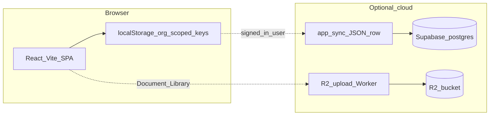

# MySafeOps — current architecture (as implemented)

This document describes the **running application** in the repository root (`src/`), not the historical prototype package in `DOCS/rams-pro.jsx` or the **optional future** Cloudflare D1 + JWT API described in older planning docs.

## High level

- **Primary persistence:** `localStorage`, with keys scoped by organisation id (`mysafeops_orgId`, default `default`).
- **Navigation:** view state in [src/App.jsx](../src/App.jsx) (no `react-router`); lazy-loaded module components.
- **Optional auth + backup:** Supabase Auth + table `public.app_sync` (one JSON payload per user + org slug). Migration: [supabase/migrations/20260407120000_app_sync.sql](../supabase/migrations/20260407120000_app_sync.sql). Client helpers: [src/utils/cloudSync.js](../src/utils/cloudSync.js); UI: **Backup** module.
- **Optional file storage:** Browser uploads to a **Cloudflare Worker** (see `cloudflare/workers/r2-upload`), not direct R2 secret keys in the app. Env: `VITE_STORAGE_API_URL`, `VITE_STORAGE_UPLOAD_TOKEN`, optional `VITE_R2_PUBLIC_BASE_URL` ([.env.local.example](../.env.local.example)).

## What is not the source of truth today

- **[DOCS/database-schema.sql](./database-schema.sql)** — illustrative / legacy **D1** schema for a multi-table backend. The SPA does **not** read or write D1; it does not require this file to run.
- **Full Workers `/api/*` CRUD** described in [cloudflare-setup.md](./cloudflare-setup.md) — **roadmap-style** content, not wired to the current React data layer.

## Deploying the frontend

- **Cloudflare Pages** (or any static host): `npm run build`, publish `dist/`. Configure SPA fallback to `index.html` if the host requires it.
- Set production **environment variables** in the host dashboard to match `.env.local.example` (only variables the build should see — remember `VITE_*` exposure rules in [README.md](../README.md)).

## Related docs

- [README.md](../README.md) — install, env, Supabase steps.
- [cloudflare-setup.md](./cloudflare-setup.md) — Pages deploy, R2, and **labelled** optional D1/API sections for future work.
- [PRODUCT_SCOPE.md](./PRODUCT_SCOPE.md) — prototype vs current feature gaps.
